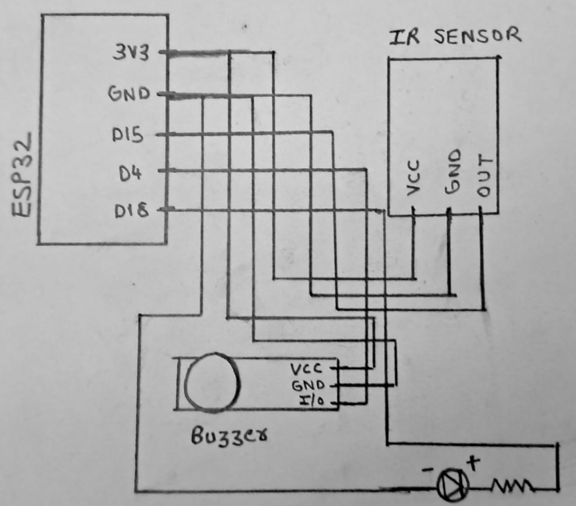
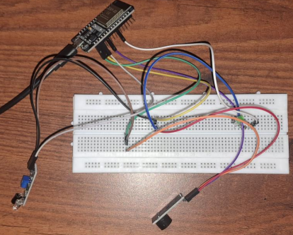

# Intruder Alert System using ESP32

This project is a simple intruder detection system built using an ESP32 microcontroller, an IR sensor, an active buzzer, and an LED indicator.  
When an object comes close to the IR sensor, the system detects it and triggers both a buzzer and an LED.

---

## Overview

The ESP32 continuously reads the output of a digital IR sensor.  
When the sensor outputs `LOW` (object detected):

- The buzzer activates (low-level trigger)
- The LED lights up  
- The event can also be monitored via serial output

Everything is powered directly from the ESP32’s 3.3V line, and all components share a common ground.

---

## Circuit Diagram

---

## Wiring Details

### **ESP32 to Sensor & Peripherals**

| Component | Pin on Component | Pin on ESP32 |
|----------|------------------|--------------|
| IR Sensor | VCC | 3.3V |
| IR Sensor | GND | GND |
| IR Sensor | OUT | D15 |
| Buzzer (Active) | VCC | 3.3V |
| Buzzer (Active) | GND | GND |
| Buzzer (Active) | I/O | D4 |
| LED | Long leg (+) via resistor | D18 |
| LED | Short leg (–) | GND |

---

## How It Works

Once powered on, the ESP32 continuously monitors the IR sensor’s digital output.  
The sensor outputs **LOW** when an object comes within detection range.  
The ESP32 reads this value on pin **D15**.

When a **LOW** signal is detected:

- The **buzzer** (connected to D4) is driven LOW, which activates it  
- The **LED** (connected to D18) is driven HIGH, turning it on  
- The **Serial Monitor** prints the detection state in real time  

When no object is detected, the system returns to its idle state:  
buzzer off, LED off, and the IR output stays HIGH.

This makes the setup function as a simple but reliable intruder-alarm mechanism.

---

## Result

The final circuit behaves as expected:

- The IR sensor detects proximity accurately  
- The active buzzer responds instantly to detection  
- The LED provides a clear visual indicator  
- The ESP32 runs the logic smoothly and prints real-time values for debugging  

The system is compact, inexpensive, and easy to extend with Wi-Fi alerts, logs, or even a mobile app.  
All components operate safely at 3.3V, and the wiring avoids direct breadboard mounting to prevent shorts.

---

## Conclusion

This project demonstrates a basic yet effective motion-triggered alert system built around the ESP32.  
By combining a digital IR sensor with an active buzzer and LED indicator, the system provides immediate audio-visual feedback when an object enters the detection zone.

The setup can be repurposed for home security, desk alarms, cupboard door alerts, or any situation where detection and instant response are needed.  
It also acts as a solid starter project for learning ESP32 GPIO control, basic electronics, and sensor-driven logic.

With additional expansions like Wi-Fi notifications, MQTT messaging, or a small OLED display, the system can evolve into a more advanced smart-security device.

